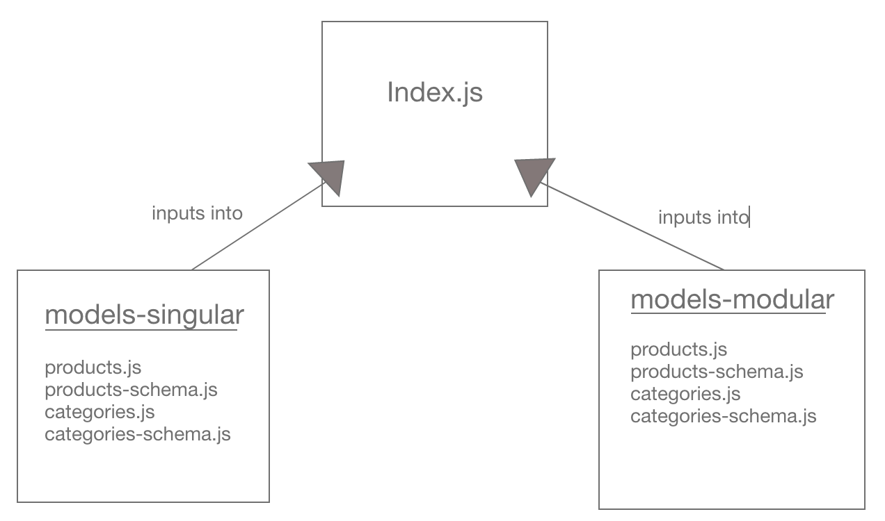

# LAB - 05

## Data Modeling With NoSQL Databases

### Author: Adrian Huebner

### Links and Resources
* [submission PR](https://github.com/Adrian-Huebner-401-advanced-javascript/lab-05/pull/1)
* [travis](https://www.travis-ci.com/Adrian-Huebner-401-advanced-javascript/lab-05)
* [front-end](https://adrianhuebner-lab05.herokuapp.com/)

### Modules
#### `categories.js` (both in models-singular file and models-modular file)
#### `products.js` (both in models-singular file and models-modular file)
##### Exported Values and Methods

###### `foo(thing) -> string`
Usage Notes or examples

#### Running the app
* `npm start`
  
#### Tests
* How do you run tests?
`npm run test` and `npm run lint`

#### UML

